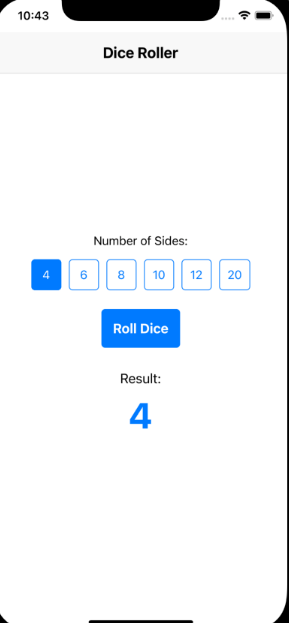

# Renton Technical College CSI-248

This repository is a part of CSI-248 at Renton Technical College.

## Independent Activity 1 - Components, Props, and useState

1. Clone the repository to your local machine. (Do not use OneDrive for assignments in this course!)
2. Make note of the folder where you cloned the repository.
3. After you have cloned this repository, navigate to your local repository.
4. Create a new Expo application in your local repository called `dice-roller-app`.
5. Create a Dice Roller app using React Native components.
6. Each section of the app should be a separate component with the data passed to it from App.js via props. Points will be deducted if props are not used to pass data between App.js and the components.
7. The app will have the following components:
   - Header (with app title)
   - DiceControl (to select number of sides)
   - RollButton (to trigger the dice roll)
   - ResultDisplay (to show the result of the roll)
8. Use useState in the App component to manage the dice sides and roll result.
9. The app should allow users to:
   - Select the number of sides on the dice (e.g., 6, 8, 20)
   - Roll the dice
   - See the result of the roll
10. The state should have the following properties:
    - DiceSides (number)
    - RollResult (number)
11. Here's an example of how the app might look:

12. Implement useState in the DiceControl component to manage the number of sides.
13. Use useState in the ResultDisplay component to show the roll result.
14. When it is completed:
    - Type `git add .` to stage all updated files.
    - Type `git commit -m "Independent Activity 1 Complete"`.
    - Type `git push`.

If you have any questions about this assignment, please reach out to myself or our TA for this course.
Feel free to message your instructor or the TA on Canvas if you have any questions.

