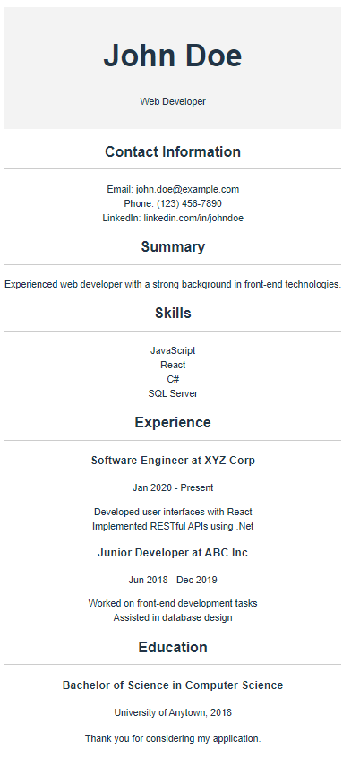

# Renton Technical College CSI-248

 

This repository is a part of CSI-248 at Renton Technical College.

## Independent Activity 1 - Components and props

1. Clone the repository to your local machine. (Do not use OneDrive for assignments in this course!)
2. Make note of the folder where you cloned the repository.
3. After you have cloned this repository navigate to your local repository
4. Create a new expo application in your local repository called resume-app

5. Create a resume using React components.
6. Each section of the resume should be a seperate component with the data passed to it from App.js via PROPS, points will be deducted of props are not used to pass data between App.js and the components.
7. The resume will have the following sections:
8. Heading with Name and Title
9. Contact Information
10. Summary
11. Skills
12. Experience
13. Education
14. Here is an example. You may choose any information to list.

15. When it is completed:
16. Type `git add .` to stage all updated files.
17. Type `git commit -m "Indepdendent Activity 1 Complete"`.
18. Type `git push`.

If you have any questions about this assignment please reach out to myself or our TA for this course.

Feel free to message your instructor or the TA on Canvas if you have any questions.
